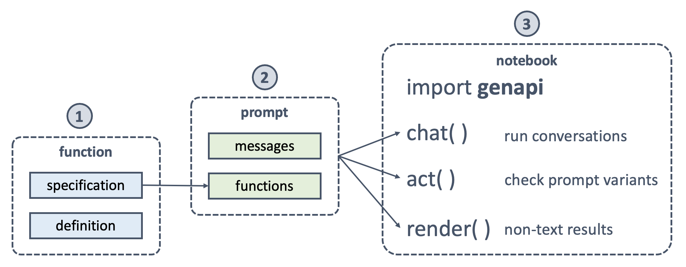

# Easy API use for Generative AI apps
Building Generative AI apps is hard enough when handling LLM peculiarities like hallucinations, latency, and cost. These apps can be increasingly more useful when integrating with enterprise and third-party APIs. However, rapid and scalable API integration with LLMs is even harder.

GenAPI is on a mission to enable *easy API use for Generative AI apps*. GenAPI has five goals to make this possible:

1. Reusable **functions** library for popular use cases like checking the weather, 
2. Simple **helper APIs** to make app prototyping as easy as running cells on a notebook,
3. Quickstart **cookbook** with notebooks for building Generative AI Apps using best practices,
4. Comprehensive **documentation** with API, LLM, and app design tips, and
5. Efficient **workflow** and project structure for building scalable Generative AI Apps.

## Cookbook
Our launch recipe is using [OpenAI Functions with Climate APIs](http://genapi.org/functions/openai-functions-with-climate-apis/) available as a Jupyter notebook. We use this notebook to illustrate a number of fundamental concepts. For example, we demonstrate how to use the helper API to simulate a chat experience within a Jupyter notebook with a simple statement. We also demonstrate with the accompanying Climate API examples how to write a function and crisp specification which can be consumed by the LLM with accuracy.

## Exploring
We are currently exploring the following topics for addition to the GenAPI roadmap.

1. https://github.com/openai/evals - can we use this to evaluate our apps?
2. Please suggest more topics.

