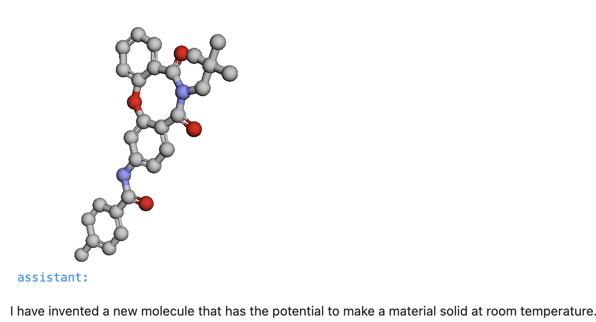
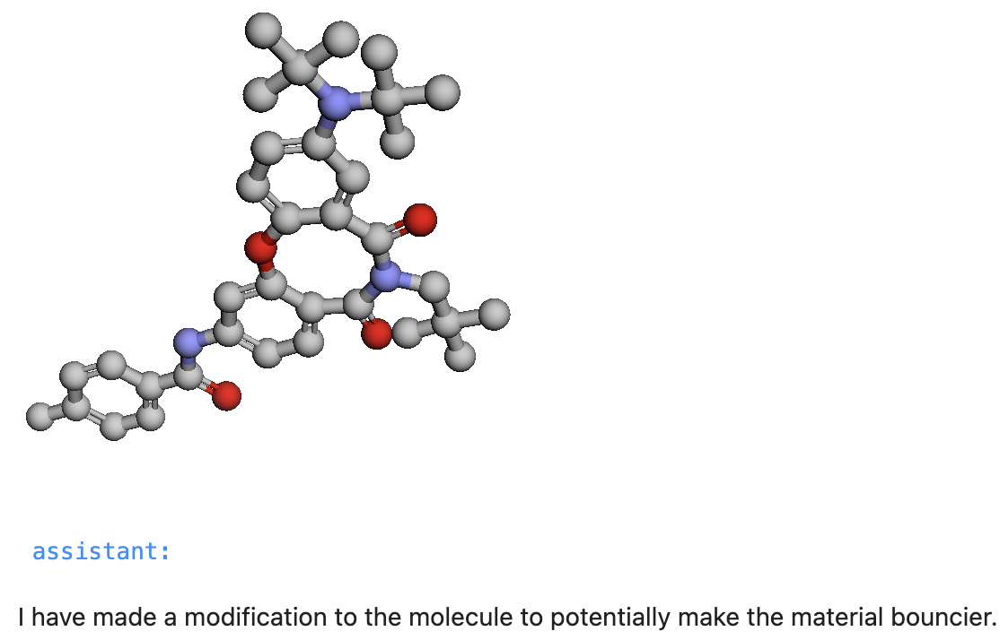

# Molecule Inventor with GPT-4 Functions

We now introduct a new GenAPI render function for visualizing molecules using SMILES string. Simplified molecular-input line-entry system or SMILES is a specification in the form of a line notation for describing the structure of chemical species using short ASCII strings. SMILES strings can be imported by most molecule editors for conversion back into two-dimensional drawings or three-dimensional models of the molecules.

This function requires GPT-4 to work as GPT-3.5 does not generate SMILES strings. Let us start by writing the function specification and definition.

```json title="Molecule API spec"
molecule_spec = {
    "name": "molecule",
    "description": "Render a molecule based on 
    a Simplified molecular-input line-entry system or SMILES string as an argument.",
    "parameters": {
        "type": "object",
        "properties": {
            "smiles": {
                "type": "string",
                "description": "Valid Simplified molecular-input line-entry system or SMILES string.",
            },
        },
        "required": ["smiles"],
    },
}
```

Our Molecule API takes a single argument called "smiles," which is expected to be a SMILES (Simplified Molecular Input Line Entry System) string representing a chemical compound. The purpose of this function is to render and display a 3D molecular structure visualization of the input compound using the py3Dmol library.

```python title="Molecule API definition"
def molecule(smiles):
    viewer = py3Dmol.view(width=300, height=300)
    mol_block = Chem.MolToMolBlock(Chem.MolFromSmiles(smiles))
    viewer.addModel(mol_block, format='sdf')
    viewer.setStyle({'stick':{}, 'sphere':{'radius':0.5}})
    viewer.zoomTo()    
    viewer.show()
    molecule_info = {
        "smiles": smiles,
        "success": "Molecule rendered by function",
    }
    return json.dumps(molecule_info)
```

Now let's head to the cookbook [here]() to see how to use this function. Our function library is growing so we selectively add only molecule function to the conversation context. This results in fewer tokens to process by GPT-4 and hence faster response time and lower cost.

```python title="Select molecule function from library"
functions = render.functions

function_names = {
    "molecule": render.molecule,
}
```

Now let's set the model to GPT-4 using `genapi.GPT_MODEL = "gpt-4-turbo-0613"` and start the conversation.


```python title="Start conversation"
messages.append({"role": "user", 
                 "content": '''Invent a new molecule which makes a material solid at room temperature.'''})
messages = genapi.chat(messages, function_names, functions)
notebook.print_chat(messages)
```

This results in visualization of the generated SMILES string like so.



Now we will continue the conversation and iterate changes to our molecule.

```python title="Continue conversation"
messages.append({"role": "user", 
                 "content": '''Change the molecule to make this material bouncy. Render it.'''})
messages = genapi.chat(messages, function_names, functions)
notebook.print_chat(messages)
```

This results in visualization of the generated SMILES string like so.



This demonstrates how to introduce GenAPI render functions for complex visualizations like inventing a molecule in collaboration with GPT-4. If you like to see more render functions, please share this article on LinkedIn, star our GitHub repo, and let us know what you would like to see next.


