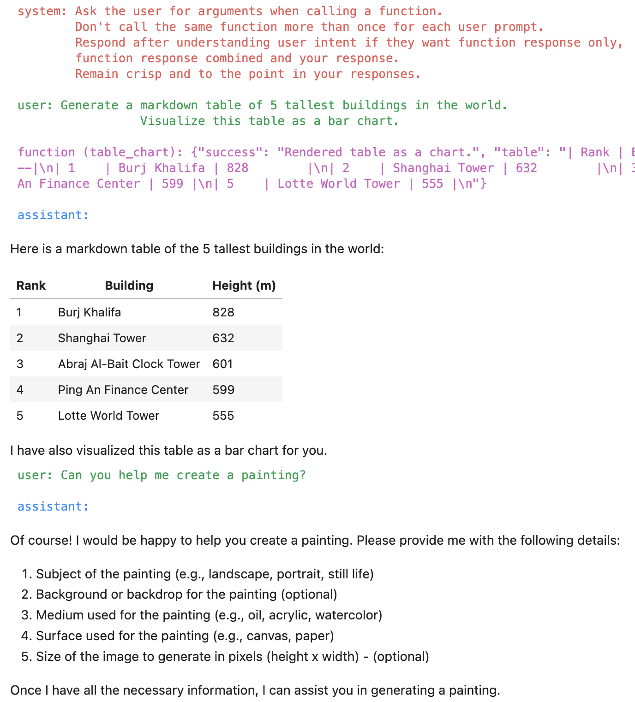

# OpenAI Functions with Render APIs

This article will show you how to use GenAPI Render APIs as OpenAI Functions. Render APIs do just that, they visually render an output based on the input arguments. This is useful for generating images, videos, and charts among other applications. Designing these APIs has been both a rewarding and challenging experiment for us. 

First, we purposely selected an API to render paintings which conflicts with the recent OpenAI parametric LLM capabilities to generate images. So, in this case we are trying to override the LLM response based on API response. 

Second, we chose an API to render a chart or plot based on LLM response in the same completion. We also try to render both the API response and the LLM response together! We wanted to avoid any post processing of LLM response to render the conversational CX. This reduces the code we need to write and increases our reliance on the right prompt engineering. The hope is that these constraints will cover a wide range of applications for our users.

## Painting API

Let us start by creating the render API to generate a painting based on given user inputs on painting subject, background, etc. We tried to design our API will a lot of flexibility in terms of the input parameters. At the same time our required arguments are minimal to keep prompt variations from simple to more involved.

```json title="Painting API spec"
painting_spec = {
    "name": "painting",
    "description": "Generate a painting.",
    "parameters": {
        "type": "object",
        "properties": {
            "subject": {
                "type": "string",
                "description": "Subject of the painting, e.g. astronaut.",
            },
            "setting": {
                "type": "string",
                "description": "Background or backdrop for the painting, e.g. alien landscape.",
            },
            "medium": {
                "type": "string",
                "description": "Medium used for the painting, e.g. oil.",
            },
            "surface": {
                "type": "string",
                "description": "Surface used for the painting, e.g. canvas.",
            },
            "artist": {
                "type": "string",
                "description": "A well known artist, e.g. Picasso.",
            },
            "size": {
                "type": "string",
                "description": "Size of image to generate in pixels heightxwidth format, e.g. 1024x512",
            },
        },
        "required": ["subject", "background"],
    },
}
```

Next we define the API function to generate the painting. We use the OpenAI Image completion API for getting the results. Note that in the return JSON value we indicate `success` key value as `Share this image link`. We are hoping this instructs the LLM to not generate an image but instead use the API response. We will see how this works late in this article.

```python title="Painting API function"
def painting(subject, background, medium="oil", surface="canvas", artist="picasso", size='512x512'):
    prompt = f"Painting of {subject} in a {background} setting, painted in {medium} on {surface} by {artist}."
    response = openai.Image.create(
            prompt=prompt,
            n=1,
            size=size
        )
    image_url = response['data'][0]['url']
    display(Image(url=image_url))

    painting_info = {
        "prompt": prompt,
        "success": "Share this image link",
        "image_url": image_url,
    }
    return json.dumps(painting_info)
```

## Table Chart API

Now we define the API function to generate a chart based on the LLM response as a Markdown table. We can choose to render a bar, line, or point chart.

```json title="Chart API spec"
table_chart_spec = {
    "name": "table_chart",
    "description": "Render a chart based on a give Markdown table.",
    "parameters": {
        "type": "object",
        "properties": {
            "markdown_table": {
                "type": "string",
                "description": "Markdown table of data to render as a chart.",
            },
            "chart_type": {
                "type": "string", 
                "enum": ["point", "bar", "line"],
                "description": "Type of chart to render.",
            },
        },
        "required": ["markdown_table", "chart_type"],
    },
}
```

Next we define the API function to generate the chart. This requires a utility function `is_alphanumeric` to check column values and identify X or Y-axis columns. The API definition is somewhat complex compared to others so far as we want the API to be generic to handle any Markdown table generated by the LLM. First part of the code converts the Markdown table to a pandas DataFrame. The second part of the function plots our chart based on the DataFrame contents.

```python title="Chart API function"
def is_alphanumeric(s):
    return s.isalnum() and (not s.isnumeric())

def table_chart(markdown_table, chart_type="bar"):
    df = pd.read_table(StringIO(markdown_table), sep="|").dropna(axis=1, how="all")
    df.columns = df.columns.str.strip()
    df = df.applymap(str.strip)
    df = df.iloc[1:].reset_index(drop=True)

    for col in df.columns:
        if df[col].apply(is_alphanumeric).all():
            continue
        
        try:
            df[col] = pd.to_numeric(df[col])
        except ValueError:
            pass

    if 'Rank' in df.columns:
        df = df.drop(columns=['Rank'])

    for col in df.columns:
        try:
            df[col] = pd.to_numeric(df[col])
        except ValueError:
            pass

    string_columns = df.select_dtypes(include=['object']).columns.tolist()
    numeric_columns = df.select_dtypes(exclude=['object']).columns.tolist()

    if not string_columns or not numeric_columns:
        raise ValueError("Table must contain at least one string and one numeric column")

    string_column = string_columns[0]
    numeric_column = numeric_columns[0]

    if chart_type == 'bar':
        sns.barplot(x=numeric_column, y=string_column, hue=string_column, data=df, dodge=False, legend=False)
        plt.legend([],[], frameon=False)
    elif chart_type == 'line':
        sns.lineplot(x=numeric_column, y=string_column, hue=string_column, data=df, legend=False)
        plt.legend([],[], frameon=False)
    elif chart_type == 'point':
        sns.scatterplot(x=numeric_column, y=string_column, hue=string_column, data=df, legend=False)
        plt.legend([],[], frameon=False)
    else:
        raise ValueError("Unsupported chart type")

    plt.show()
    
    table_chart_info = {
        "success": "Rendered table as a chart.",
        "table": markdown_table,
    }
    return json.dumps(table_chart_info)
```

All that remains is for us to add these functions to our library like so.

```python title="Add functions to library"
functions = []
functions.append(painting_spec)
functions.append(table_chart_spec)
```

## Rendering the customer experience

Now let's head to our Jupyter Notebook and try these functions out. We start by importing our helper APIs and functions library.

```python title="Import helper APIs and functions library"
from helpers import genapi, notebook
from functions import climate, render
```

Next we combine the two libraries like so. This technique is modular so as we add more libraries we can combine them all together or decide to drop the ones we are not using for our current use case.

```python title="Combine libraries"
functions = climate.functions
functions.extend(render.functions)

function_names = {
    "weather": climate.weather,
    "air_quality": climate.air_quality,
    "painting": render.painting,
    "table_chart": render.table_chart
}
```

Now we modify the system prompt to handle a few more quirks where LLM may try to take over the response generation or as we noted when calling the chart API the LLM goes into a loop and calls the function many times!

```python title="Modify system prompt"
messages = []
messages.append(
    {
        "role": "system", 
        "content": '''Ask the user for arguments when calling a function. 
        Don't call the same function more than once for each user prompt.
        When calling a function do not respond other than what is in the function response.'''
    })
```

## Trying out Chart API

Now let's try the Chart API.

```python title="Try Chart API"
messages.append({"role": "user", 
                 "content": '''Generate a markdown table of 5 tallest buildings in the world.
                 Visualize this table as a bar chart.'''})
messages = genapi.chat(messages, function_names, functions)
notebook.print_chat(messages)
```

This magically generates the following chart and markdown table combining the LLM response and the API response. Super cool isn't it?


## Testing the Painting API

Well let's try the Painting API now.

```python title="Try Painting API"
messages.append({"role": "user", "content": "Can you help me create a painting?"})
messages = genapi.chat(messages, function_names, functions)
notebook.print_chat(messages)
```

LLM responds by asking the user for the painting subject, background, etc.

```text title="LLM response"
Of course! I'd be happy to help you create a painting. Please provide me with some details:

Subject of the painting (e.g., landscape, portrait, still life, etc.).
Background or backdrop for the painting (e.g., beach, forest, cityscape, etc.).
Medium you would like to use for the painting (e.g., oil, acrylic, watercolor, etc.).
Surface you would like to paint on (e.g., canvas, paper, wood, etc.).
If you have any preference for a well-known artist or any specific style, please let me know.
If you have a preferred size for the painting (in pixels height x width format), please provide that as well.
Once I have these details, I can generate a painting for you.
```

The user just responds with the painting subject and background.

```python title="User response"
messages.append({"role": "user", 
"content": "it should be about an astronaut looking over a beautiful alien valley background."})
messages = genapi.chat(messages, function_names, functions)
notebook.print_chat(messages)
```

The response is a beautiful painting with default argument values from combined with the user provided arguments. The LLM also tries to render the image but we have instructed it to use the API response instead. This is not perfect yet and it seems we may require some post processing of LLM + API response for production customer experiences to control this.


We are on a roll! Let's try another prompt, this time we provide the painting subject, background, style, surface, and medium.

```python title="User provides many arguments"
messages.append({"role": "user", 
"content": '''Create painting of a lone warrier 
on the streets of a futuristic cyberpunk city painted in the style of Richard Estes,
in watercolor on sanded gessobord.'''})
messages = genapi.chat(messages, function_names, functions)
notebook.print_chat(messages)
```

Let's look at the results. The LLM responds with the completed prompt and the API response is a beautiful painting matching our arguments.


```text title="LLM response"
The painting features a lone warrior on the streets of a futuristic cyberpunk city, painted in the style of Richard Estes. It is created using watercolor on sanded gessobord.
```

## Testing the Weather API

To test if our new APIs coexist with the existing ones we try the weather API.

```python title="Try weather API"
messages.append({"role": "user", "content": "How is the weather in Boston, MA?"})
messages = genapi.chat(messages, function_names, functions)
notebook.print_chat(messages)
```

And the LLM responds with `The current weather in Boston, MA is few clouds with a temperature of 54.25°F.` as expected.

## Evaluating the conversation session

We can also evaluate the entire conversation session using `notebook.print_chat(messages, all=True)` helper API.




# Conclusion

You can download the Jupyter Notebook for this article from [here](
