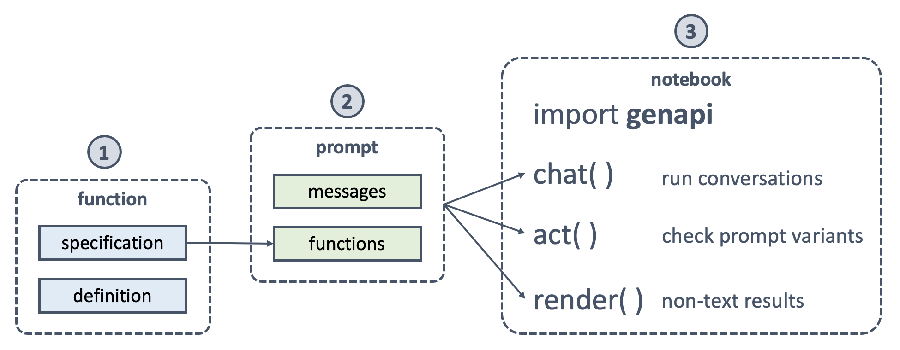

# Easy API use for Generative AI apps

Building Generative AI apps is hard enough when handling LLM peculiarities like hallucinations, latency, and cost. These apps can be increasingly more useful when integrating with enterprise and third-party APIs. However, rapid and scalable API integration with LLMs is even harder. GenAPI is on a mission to enable *easy API use for Generative AI apps*.

GenAPI has five goals to make this possible:

1. Reusable **functions** library for popular use cases like checking the weather, 
2. Simple **helper APIs** to make app prototyping as easy as running cells on a notebook,
3. Quickstart **cookbook** with notebooks for building Generative AI Apps using best practices,
4. Comprehensive **documentation** with API, LLM, and app design tips, and
5. Efficient **workflow** and project structure for building scalable Generative AI Apps.

## Quickstart Cookbook
Our launch recipe is using [OpenAI Functions with Climate APIs](functions/openai-functions-with-climate-apis.md) available as a Jupyter notebook. We use this notebook to illustrate a number of fundamental concepts. For example, we demonstrate how to use the helper API to simulate a chat experience within a Jupyter notebook with a simple statement. We also demonstrate with the accompanying Climate API examples how to write a function and crisp specification which can be consumed by the LLM with accuracy.

We have since launched [OpenAI Functions with Render APIs](functions/openai-functions-with-render-apis.md) to render paintings and charts using GPT models. We have also launched [Molecule Inventor with GPT4 Functions](functions/molecule-inventor-with-gpt4-functions.md) to demonstrate complex interactive visualizations in collaboration with LLM response.

## Reusable Functions
The GenAPI functions library is a collection of reusable functions for popular use cases. These include functions for rendering paintings, charts, and 3D molecules. We also have functions for checking the weather and air quality. Check out the code in [GenAPI GitHub](https://github.com/genapiorg/genapi) repo for more details.

## Helper APIs
The GenAPI helper APIs are a collection of simple APIs to make app prototyping as easy as running cells on a notebook. These include APIs for rendering to a Jupyter Notebook and simulating a chat experience. Check out the code in [GenAPI GitHub](https://github.com/genapiorg/genapi) repo for more details.

