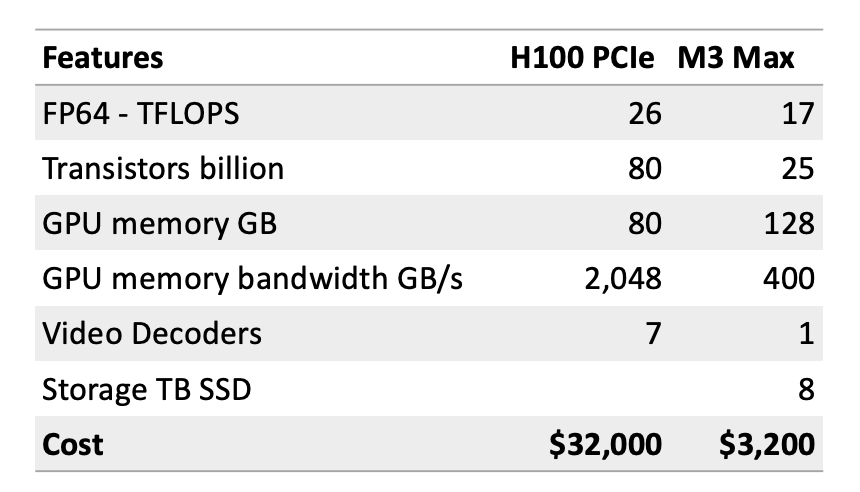
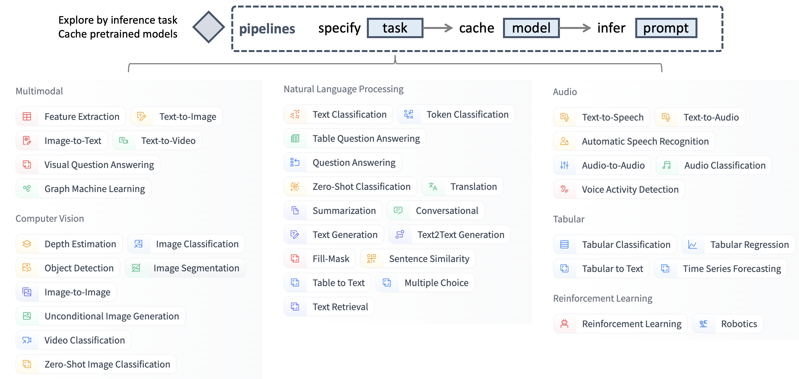
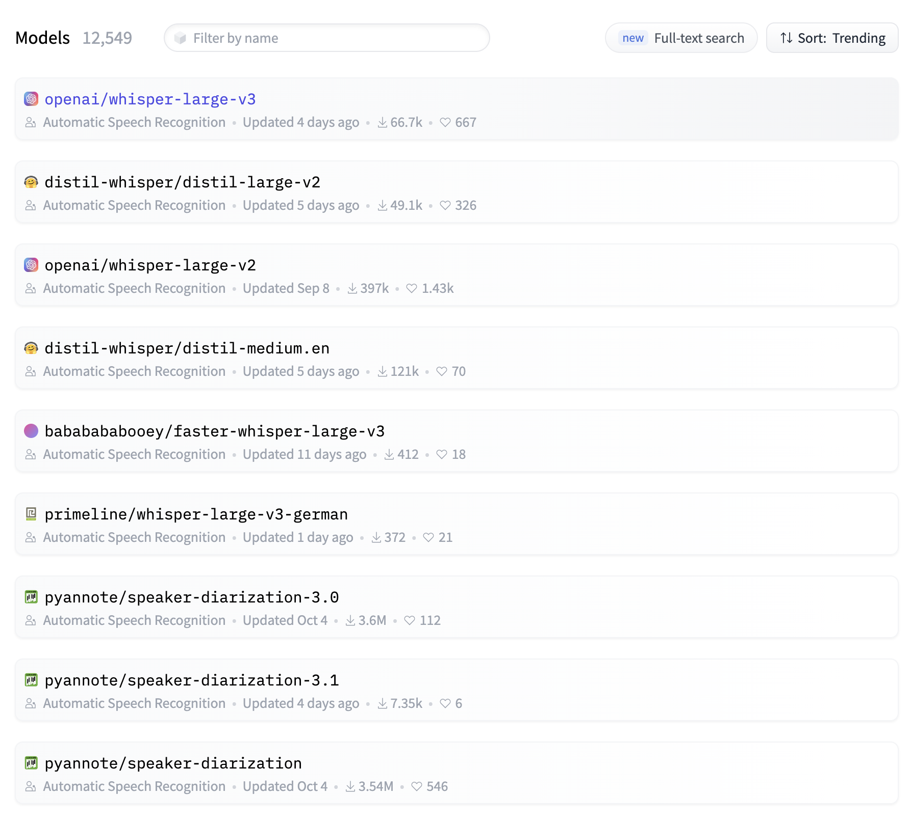
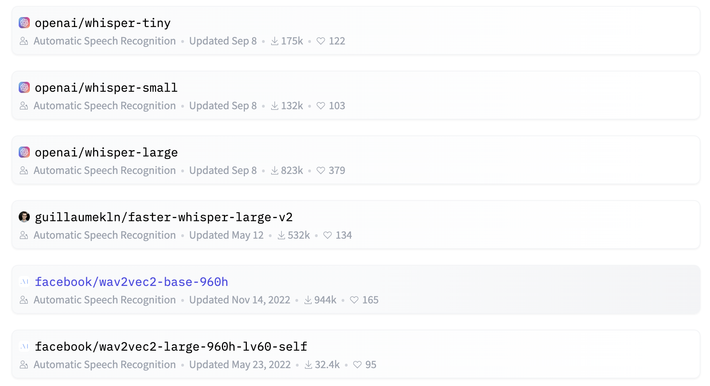
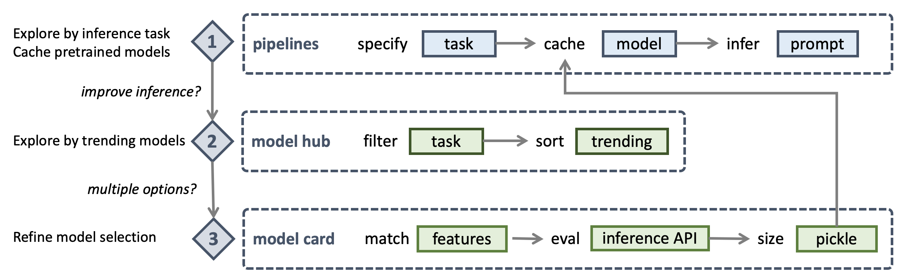
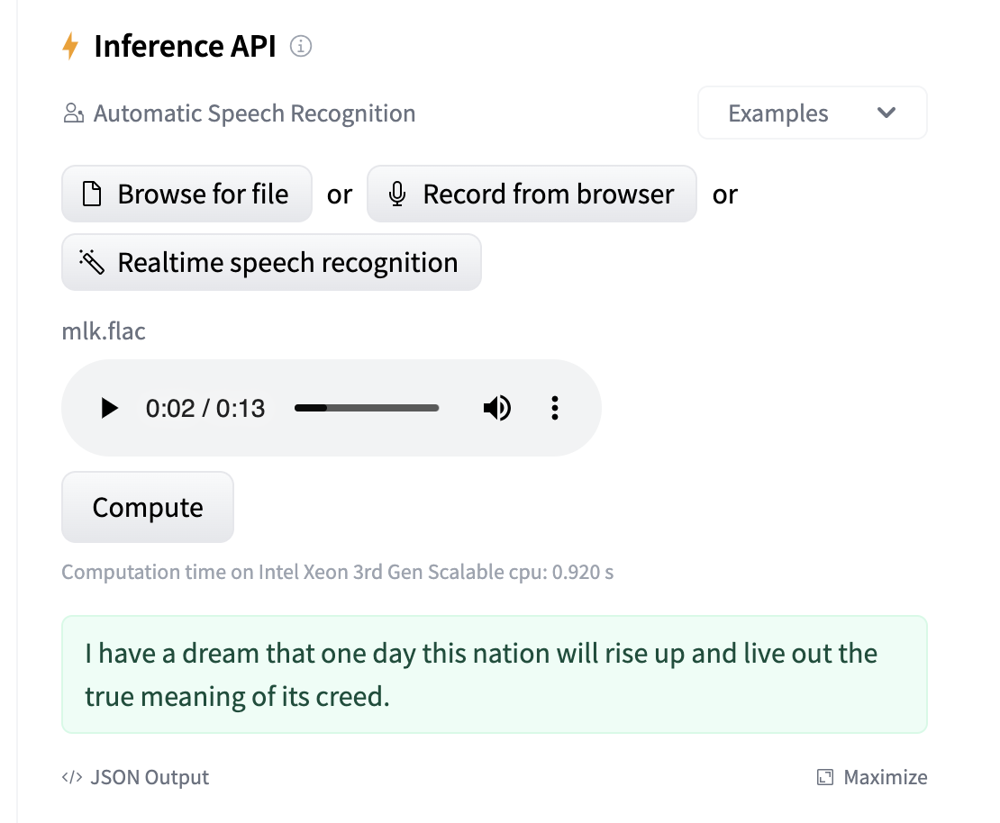

---
tags:
  - Generative AI
  - Hugging Face
description: >- 
    We will setup a development environment with Jupyter Notebook. 
    We will install the minimum set of dependencies required to get started developing 
    using deep learning transformer models available at Hugging Face.
---

# Hugging Face Generative AI Developer Setup on a Mac

This article explains step-by-step how to setup your Mac for developing Generative AI applications using Hugging Face Transformer models. We will use Jupyter Notebook for our development environment. We will install the minimum set of dependencies required to get started developing using deep learning transformer models available at Hugging Face. Let us first understand the reasons why you should consider a Mac for your Gen AI development over a Cloud based setup using the most popular NVIDIA GPU options.

## Performance vs Cost vs Availability

GPUs are the hardest to source components of your Gen AI stack. They are also the most expensive decisions you will make when building your Gen AI apps.

As of Nov 2023, Apple has announced the MacBook Pro with M3 Max chip featuring 16-core CPU with 12 performance cores and 4 efficiency cores, 40-core GPU, Hardware-accelerated ray tracing, 16-core Neural Engine, and 400GB/s memory bandwidth. It has 48GB unified memory which is configurable to 128GB. The storage of 1TB SSD is configurable to 8TB.



Surprisingly, on performance M3 Max comes pretty close when you consider TFLOPS (number of floating point calculations per second), number of transistors packed into the chip, GPU accessible memory and bandwidth. Integrated SSD storage means when compared to cloud based H100 setups, you win on network latency and bandwidth.

You can buy a Mac laptop relatively easily starting as low as $3,200 one time cost. An Nvidia H100 PCIe is around 10x that price at $32,000 and that is only the chip. You will need a cloud provider like AWS supporting H100s if you want to use these. As of Nov 2023, when you search for AWS P5 instances (available with 8 to 48 H100 configurations), you may only find p5.48xlarge instances available at around $80,000 monthly cost.

## Training vs Inference

Training an LLM is significantly more GPU intensive depending on several factors including the size of the model, the size of the dataset, the number of epochs, and the batch size. Inference is less GPU intensive as you are not training the model but using the model to generate text or images. There have been significant advancements in making inference more efficient, such as model quantization, pruning, and the use of dedicated inference chips. These techniques can reduce the computational load and the number of GPUs needed for running a trained model.

Hugging Face offers many pretrained transformer models which you can use for inference. You can also use these models for transfer learning. This means you can use a pretrained model and fine tune it for your specific use case. This is a great way to get started with Gen AI development without having to train your own models.

!!! info "Note"
    At the time of writing this article we are using a 2022 MacBook Pro 2 GHz Quad-Core Intel Core i5, Intel Iris Plus Graphics 1536 MB, and 16GB RAM, which costs around $1,700. As we will mostly use pretrained models for inference, we will not even need a GPU for our development setup!

## Open Source Innovation

As on Nov 2023, Hugging Face lists more than 400,000 models and more than 79,000 datasets which can be downloaded on your Mac for learning transfer models or using these for building personal AI projects.

Open source models are usually ahead of close source models by a few months when it comes to new research. Hugging Face had Visual Question Answering model available several months sooner than ChatGPT and Bard support for visual imputs. Hugging Face also has a large community of developers contributing to the open source models and datasets. This means you can get help from the community when you are stuck with a problem.

## Personal AI

There may be cases where for company confidentiality reasons, to stay ahead of peer competition, or for self learning, you may want to use your own laptop based Gen AI setup. A Mac setup can also serve as local developer environment for your cloud based Gen AI app. Some of the best practices of optimizing for resource contrained devices like a laptop can also help save dollars on cloud based Gen AI apps.

With a business case for personal Gen AI established, let us get started with our Mac based development setup.

## Setup Development Environment

First, you should be running the latest Python on your system with Python package manager upgraded to the latest.

```bash
python --version
# should return Python 3.10.x or higher as on Jan'23
pip --version
# should return pip 22.3.x or higher as on Jan'23
```

Follow this guide for [Mac OS X](https://docs.python-guide.org/starting/install3/osx/) if you do not have the latest Python. If installing specific version of Python for managing dependencies then follow [this thread](https://apple.stackexchange.com/questions/237430/how-to-install-specific-version-of-python-on-os-x) to install using `pyenv` Python version manager. If required upgrade pip to the latest using the following command.

```bash
pip install --user --upgrade pip
```

We will now create a virtual environment for our setup so that our dependencies are isolated and do not conflict with the system installed packages. We will follow [this guide](https://packaging.python.org/en/latest/guides/installing-using-pip-and-virtual-environments/#creating-a-virtual-environment) for creating and managing the virtual environment. First change to the directory where we will develop our application.

```bash
python -m venv env
```

If you run ls env you will see following folders and files created.

```bash
bin        include    lib        pyvenv.cfg
```

Now we can activate our virtual environment like so. You will notice that development directory prefixed with the (env) to indicate you are now running in the virtual environment.

```bash
. env/bin/activate
```

You can confirm that you are not running inside the virtual environment with its own Python.

```bash
which python
## should return /Users/.../env/bin/python
```

To leave the virtual environment using the `deactivate` command. Re-enter using same command as earlier.

Now we are ready to install our dependencies for running Hugging Face Transformer models with PyTorch.

```bash
pip install torch torchvision transformers
```

We can test our installation with the following script.

```bash title="Test Installation"
python -c "from transformers import pipeline; \
print(pipeline('sentiment-analysis')('we love you'))"

# [{'label': 'POSITIVE', 'score': 0.9998704195022583}]
```

Now we can setup our development environment which is Jupyter Notebook and [Jupyter Widgets](https://ipywidgets.readthedocs.io/en/stable/index.html).

```bash
pip install notebook ipywidgets
```

One last thing we will do is to setup a custom cache directory for our models and datasets downloaded when using Hugging Face. Edit your bash script. On zsh shell this is the  ~/.zshrc file. This is required as the default cache directory is in the home directory which is not a good idea as it will fill up your home directory with large files. When you run Hugging Face API for the first time, it will download the models and datasets to the default cache directory. You can change the default cache directory by setting the environment variables.

```bash title="~/.zshrc"
export TRANSFORMERS_CACHE="/Users/.../cache/transformers"
export HUGGINGFACE_HUB_CACHE="/Users/.../cache/hub"
export HF_HOME="/Users/.../cache/huggingface"
```

That is it! We setup a development environment with Jupyter Notebook. We installed the minimum set of dependencies required to get started developing using pretrained transformer models available at Hugging Face.

## Explore Hugging Face Models
Our next step is to explore the Hugging Face models by inference tasks. We will use the [Hugging Face pipelines](https://huggingface.co/docs/transformers/main_classes/pipelines) for this purpose.

Hugging Face offers more than 400,000 models which are classified under six categories of around 40 inference tasks - multimodal, computer vision, natural language processing, audio, tabular, and reinforcement learning. An example of a multimodal inference task is text to image generation. Likewise, an example of a computer vision inference task is image classification. When exploring Hugging Face models, unless you know exactly which model you want to use, it is best to start with the inference task and then explore the models available for that task.



## Hugging Face Pipelines

Let us now fire up the `juputer notebook` using Terminal and enter our first pipeline to explore Automatic Speech Recognition (ASR) models. We will take the famous statement by Martin Luther King Jr. and convert it to text using the ASR model.

```python title="Explore Hugging Face pipelines"
from transformers import pipeline
model = pipeline(task="automatic-speech-recognition")
model("https://huggingface.co/datasets/Narsil/asr_dummy/resolve/main/mlk.flac")

# {'text': 'I HAVE A DREAM BUT ONE DAY THIS NATION 
# WILL RISE UP LIVE UP THE TRUE MEANING OF ITS TREES'}
```

As you execute the pipeline statement, you will notice following message in the notebook cell output. This means the pipeline API automatically selects the best model for the task. In this case, it is the [wav2vec2-base-960h](https://huggingface.co/facebook/wav2vec2-base-960h) model.

```text title="Hugging Face pipeline output"
No model was supplied, defaulted to facebook/wav2vec2-base-960h 
and revision 55bb623 (https://huggingface.co/facebook/wav2vec2-base-960h).
Using a pipeline without specifying a model name 
and revision in production is not recommended.
```

You can also check the `model_cache/transformers` folder to see the downloaded model files under a folder named after the model name and revision `models--facebook--wav2vec2-base-960h` in this case. A quick Get Info on the folder will show you the size of the model files. In this case, it is 392MB.

Next you will notice the inference output is not entirely accurate. The accurate statement is `I have a dream that one day this nation will rise up and live out the true meaning of its creed` as per [NPR source](https://www.npr.org/2010/01/18/122701268/i-have-a-dream-speech-in-its-entirety). However, note that actual speech does not have the `and` word in the phrase `rise up, live out`. This is an important note for us to remember when we try to improve the accuracy of our Gen AI app.

## Model Hub

You can visit the model hub filtered by inference task (https://huggingface.co/models?pipeline_tag=automatic-speech-recognition) to see if there are more trending models than the one used by pipelines API. Higher trending models are more recently updated and have more downloads and votes. Higher trending models are usually more accurate.





## Model Hub and Card Workflow

As you are optimizing for memory, inference time, and accuracy, you would want to do some research before trying out a trending model and see if it improves the inference accuracy, yet does not cost compute and memory. The top trending model may be most accurate, however it may also be the most expensive on resources.



You may intuitively start from the top of the model hub list and read the model card for [openai/whisper-large-v3](https://huggingface.co/openai/whisper-large-v3). You can check the model size by switching to [Files and versions](https://huggingface.co/openai/whisper-large-v3/tree/main) tab and notice the `pytorch_model.bin` pickle file is 3GB which is almost 10x the size of the wav2vec2-base-960h model. The whisper-v3 model is multilingual however our use case only requires English support. So we read the model card and check [whisper-tiny.en](https://huggingface.co/openai/whisper-tiny.en) which is only 151MB, half the size of the wav2vec2-base-960h model. Nice! Let us try this model.

```python title="Load model directly"
model = pipeline(model="openai/whisper-tiny.en")
model("https://huggingface.co/datasets/Narsil/asr_dummy/resolve/main/mlk.flac")

# {'text': ' I have a dream that one day this nation 
# will rise up live out the true meaning of its creed'}
```

This is 100% accurate result with 60% smaller, top trending model, and faster inference.

Let us be greedy and see if we can do even better than the input speech and add proper English grammar. Notice that our output missed `and` in the sentence. Let us try the next larger model https://huggingface.co/openai/whisper-base.en which is 290MB in size and still smaller than the wav2vec2-base-960h model.

## Exploring and dowlnoading datasets locally

Before we download the model we can try it out using Hugging Face Inference API. Let us first download the speech file locally by visiting [Hugging Face Datasets](https://huggingface.co/datasets) and searching for `Narsil` to find the dataset card for https://huggingface.co/datasets/Narsil/asr_dummy. We can now switch to Files and versions tab to download the `mlk.flac` file locally.

## Evaluating the model using Inference API

Now let us head back to the https://huggingface.co/openai/whisper-base.en model card and use the Inference API to test the model.



Note the computation time message below the Compute button. This way we can also quickly compare the inference time for different models before we cache these locally.

This is the result we are looking for. Let us cache the model locally and use it in our pipeline.

```python title="Improve app accuracy incrmentally"
model = pipeline(model="openai/whisper-base.en")
model("https://huggingface.co/datasets/Narsil/asr_dummy/resolve/main/mlk.flac")

# {'text': ' I have a dream that one day this nation
# will rise up and live out the true meaning of its creed.'}
```
Perfect! We have improved our Gen AI app accuracy incrementally by using a trending model. 

## Calculating inference time

Now we can add `%time` magic command to the cells in our Jupyter Notebook where we call the `model` function. Here are the results on our MacBook Pro 2 GHz Quad-Core Intel Core i5 CPU, Intel Iris Plus Graphics 1.5GB integrated GPU, and 16GB RAM.

```python title="Inference time"
# facebook/wav2vec2-base-960h (392MB cache size)
CPU times: user 18 µs, sys: 1 µs, total: 19 µs
Wall time: 7.87 µs

# openai/whisper-tiny.en (151MB cache size)
CPU times: user 2 µs, sys: 0 ns, total: 2 µs
Wall time: 5.96 µs

# openai/whisper-base.en (290MB cache size)
CPU times: user 2 µs, sys: 0 ns, total: 2 µs
Wall time: 4.77 µs
```

Note that the facebook model uses multiple CPU cores to complete the task (wall time) sooner than CPU time (total time spent by multiple cores). Whereas whisper-tiny.en and whisper-base do not seem to benefit from multi-core processing. Yet we save 40% in inference time with openai over facebook models. This adds up when you are running inference on a large dataset.

We have demonstrated multimodal capabilities of latest OpenAI Whisper v3 model which not only accurately recognized speech to text but also used text to text grammar capabilities to improve the inference output. We have also selected optimal model for our use case with reduced size by 27% and improved the inference time. We can now use this model for our app.
